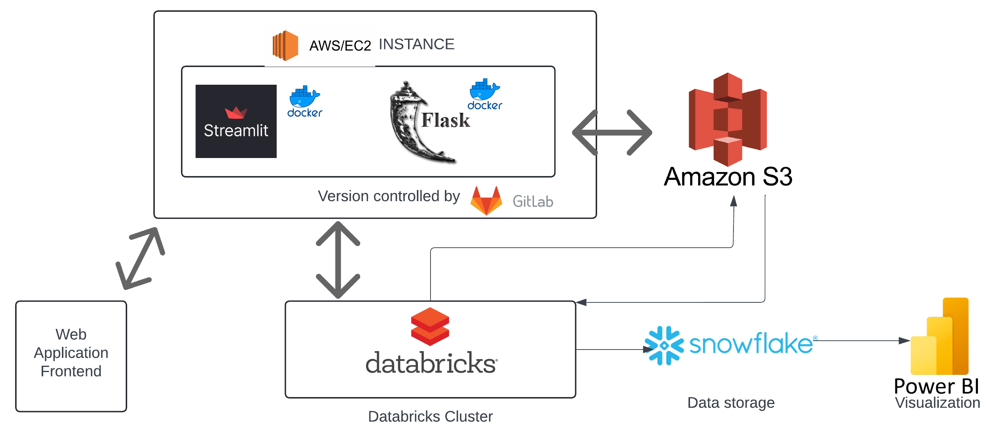
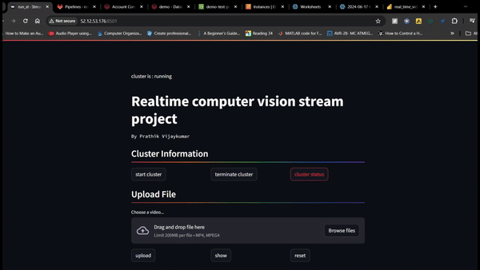

# Real-Time Video Stream Analytics

## Overview

The Real-Time Video Stream Analytics application is a robust full-stack web application designed to upload and analyze vehicular traffic videos in real time. It allows users to upload traffic videos to AWS S3, process them through a Databricks pipeline running Apache Spark to perform object detection, tracking, and counting. The application showcases advanced data engineering, full-stack development, computer look capabilities, and adherence to software development best practices.

## Architecture:


### Features
- **Video Upload:** Users can upload traffic videos to be processed.
- **Real-Time Processing:** Utilizes Apache Spark on Databricks for real-time video frame processing.
- **Object Detection and Tracking:** Implements YOLOv8n for accurate and efficient object detection and tracking.
- **Data Visualization:** Integrates with Snowflake and Power BI for real-time data visualization of analysis results.
- **Public Accessibility:** Hosted on an AWS EC2 instance, available for public use.




### Goals
1. Demonstrate advanced data engineering capabilities with Apache Spark and Databricks.
2. Create a full-stack, publicly accessible application.
3. Showcase computer look prowess using state-of-the-art models.
4. Adhere to best practices with CI/CD pipelines via GitLab.
5. Utilize modern data storage and visualization tools (Snowflake and Power BI).

## Installation

### Prerequisites
- Docker
- AWS Account
- Databricks Account
- Power BI Account
- Snowflake Account

### Setup Instructions
1. **Clone the Repository:**
   ```bash
   git clone [repository-url]
   cd real-time-video-stream-analytics
   ```

2. **Docker:**
   Build and run the application using Docker.
   ```bash
   docker build -t video-analytics-app .
   docker run -p 8501:8501 video-analytics-app
   ```

3. **AWS Configuration:**
   Configure your AWS credentials to access S3.
   ```bash
   aws configure
   ```

4. **Environment Variables:**
   Set the required environment variables for Databricks, Snowflake, and Power BI.

## Usage

1. **Starting the Application:**
   Access the application through your browser at `http://localhost:8501` if running locally, or use the public EC2 instance URL.

2. **Uploading Videos:**
   Use the interface to upload vehicular traffic videos for processing.

3. **Running the Analysis:**
   Click "Run Job" to start the video processing pipeline on Databricks.

4. **Viewing Results:**
   After processing, click "Show Output" to view the output video and the real-time graphs for person and vehicle counts.

## Technology Stack
- **Frontend:** Streamlit, Flask
- **Backend:** AWS S3, Databricks (Apache Spark), Snowflake
- **CI/CD:** GitLab, Docker
- **Data Visualization:** Power BI
- **Deployment:** AWS EC2

## Contributing

Interested in contributing? We welcome contributions from developers of all skill levels. Please fork the repository and submit your pull requests. For major changes, please open an issue first to discuss what you would like to change.

Please ensure to update tests as appropriate.

## License

[MIT](https://choosealicense.com/licenses/mit/)
